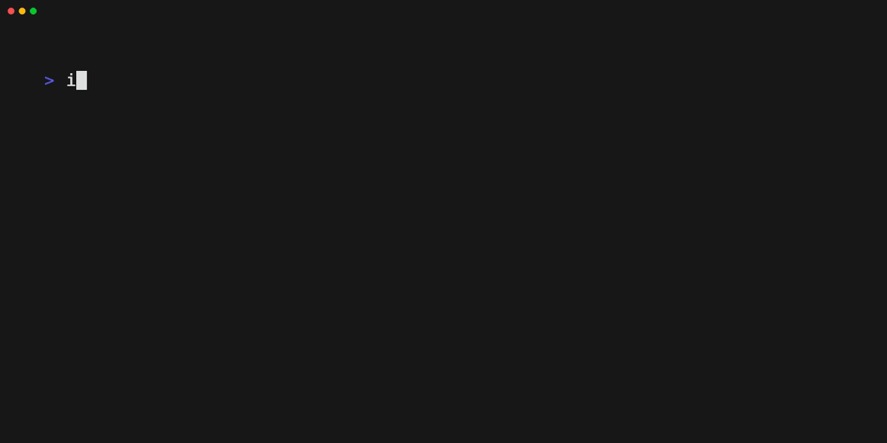
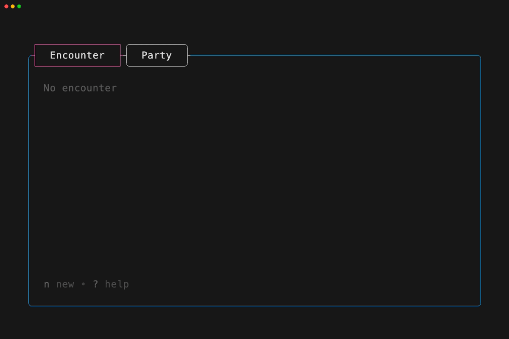
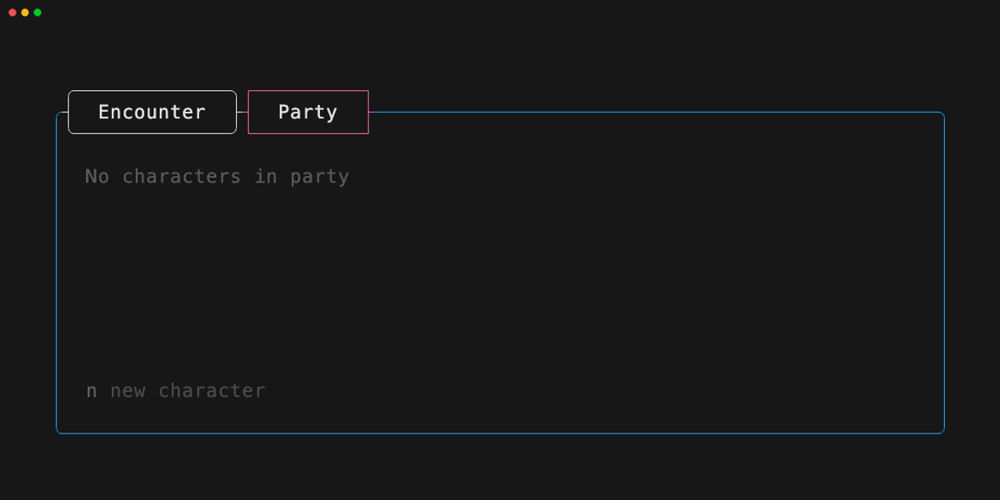
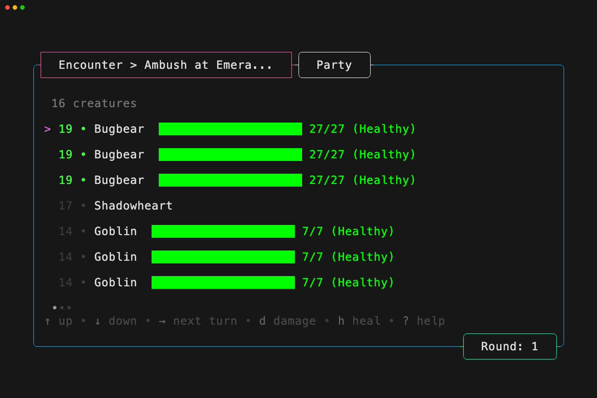
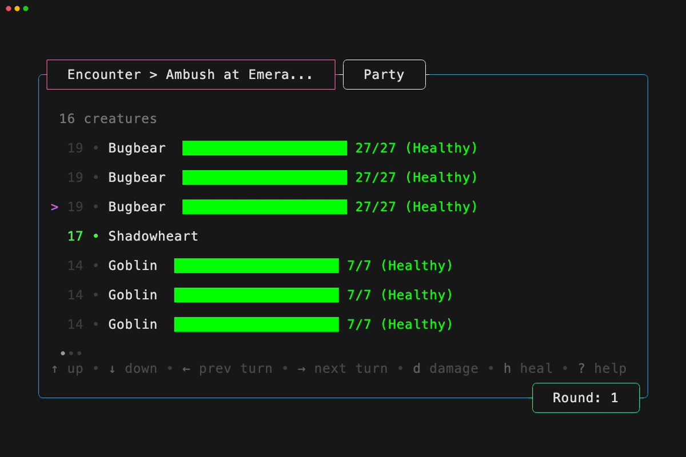
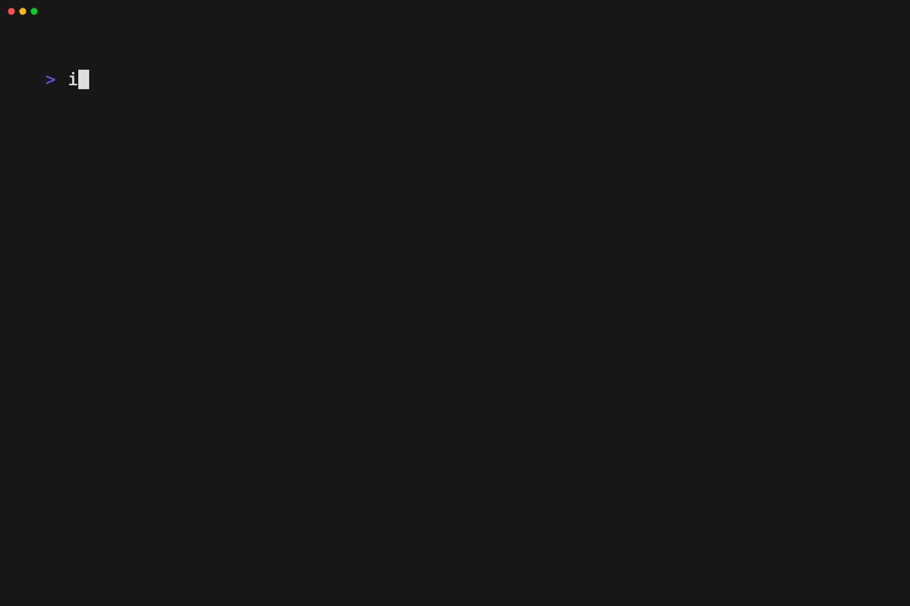

# Initiative

A powerful CLI for running **Dungeons & Dragons** encounters. Track initiative, health, effects, and turns with an intuitive terminal interface.

<!-- todo: update the tape to showcase the app -->
<!--  -->

**initiative** is built with [Cobra](https://github.com/spf13/cobra) and the [Charm](https://charm.land/) ecosystem: [Bubble Tea](https://github.com/charmbracelet/bubbletea), [Bubbles](https://github.com/charmbracelet/bubbles), [Lipgloss](https://github.com/charmbracelet/lipgloss), [Huh?](https://github.com/charmbracelet/huh), and [more](#built-with).

# Encounters

<!-- todo: implement tape -->
<!--  -->

Start encounters to track initiative of characters and monsters, health of the monsters and track effects throughout the encounter.

# Characters

<!-- todo: implement tape -->
<!--  -->

Organize your party members and NPCs, which can be added to encounters quickly.

# Initiative

<!-- todo: implement tape -->
<!--  -->

Automatically sort and manage turn order during combat. Navigate between characters seamlessly and keep the game flowing.

# Health

<!-- todo: implement tape -->
<!--  -->

Track hit points and damage with visual health bars and intuitive controls for quick updates during gameplay.

# Sources

<!-- todo: implement tape -->
<!--  -->

**initiative** is shipped with the System Reference Document, but allows you to bring additional sources!

# Contributing

See [CONTRIBUTING.md](CONTRIBUTING.md) to get started.

# Feedback

We'd love to hear from you!

- **Bugs**: [Submit an issue](https://github.com/joelzwarrington/initiative/issues/new) for bugs or problems
- **Ideas**: [Share your ideas](https://github.com/joelzwarrington/initiative/discussions/new?category=ideas) for new features or improvements
- **Questions**: [Ask questions](https://github.com/joelzwarrington/initiative/discussions/new?category=q-a) about usage or functionality

# Built With

- [[Cobra](https://github.com/spf13/cobra)] library for creating powerful modern CLI applications
- [[Bubble Tea](https://github.com/charmbracelet/bubbletea)] powerful terminal user interface framework
- [[Skeleton](https://github.com/joelzwarrington/skeleton)] tab framework for Bubble Tea applications
- [[Bubbles](https://github.com/charmbracelet/bubbles)] components for Bubble Tea applications
- [[Lipgloss](https://github.com/charmbracelet/lipgloss)] beautiful terminal styling
- [[Huh?](https://github.com/charmbracelet/huh)] interactive prompts and forms

# License

[MIT](https://github.com/joelzwarrington/initiative/raw/main/LICENSE)

In addition, this work also includes material from the System Reference Document 5.2.1 ("SRD 5.2.1") by Wizards of the Coast LLC, available at https://www.dndbeyond.com/srd. The SRD 5.2.1 is licensed under the Creative Commons Attribution 4.0 International License, available at https://creativecommons.org/licenses/by/4.0/legalcode.

---

Built with ♥ by [@joelzwarrington](https://github.com/joelzwarrington)
